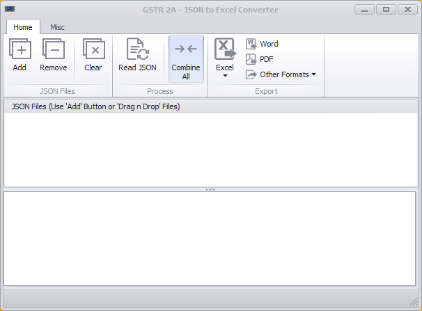
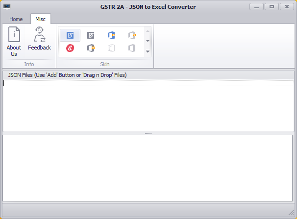
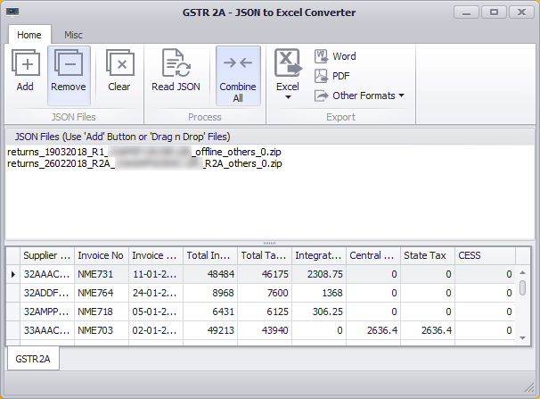
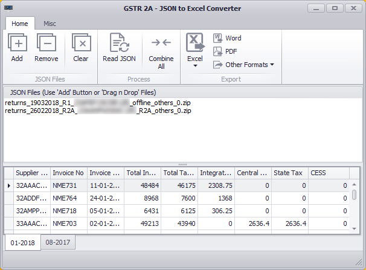

# Devil7 - Automation Tools
## GSTR 2A - JSON File to Excel Converter

A simple tool to convert GSTR 2A JSON files downloaded from GST website of Govt. of India.

The offline tool provided by GSTN itself can open those JSON files, hence it doesn't allow the user to export it into different formats.

This tool parses the downloaded json files and allows the user to export it into different formats including **Excel, Word, CSV and PDF formats.**

This tool was a part of my automation projects (well... we can call it laziness).

### How to use?
1. Download GSTR 2A returns file from GST Site (Many other return reports also supported)
2. Click on "Add" button in "JSON Files" group. And select downloaded files. OR 'Drag-n-Drop' files into list directly.
3. Click "Read JSON" button to parse JSON Files. If combined mode is turned on the application will combine data from all json files into one. Or if you want them separately uncheck "Combine" button.
4. Then you can export the parsed data into any format you wish.

### Screenshots

